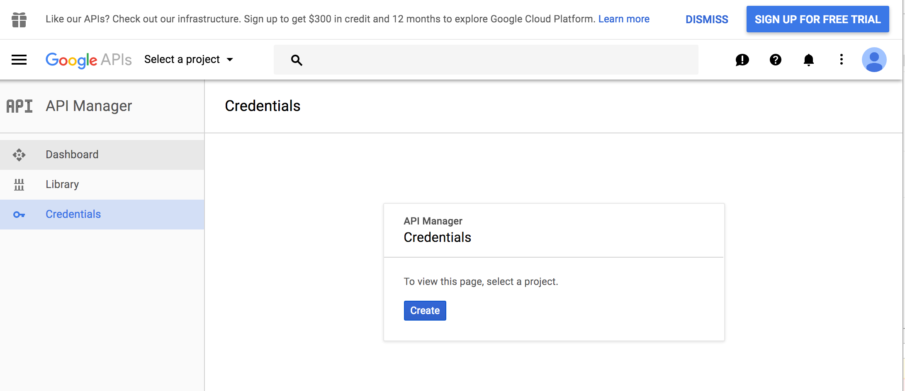
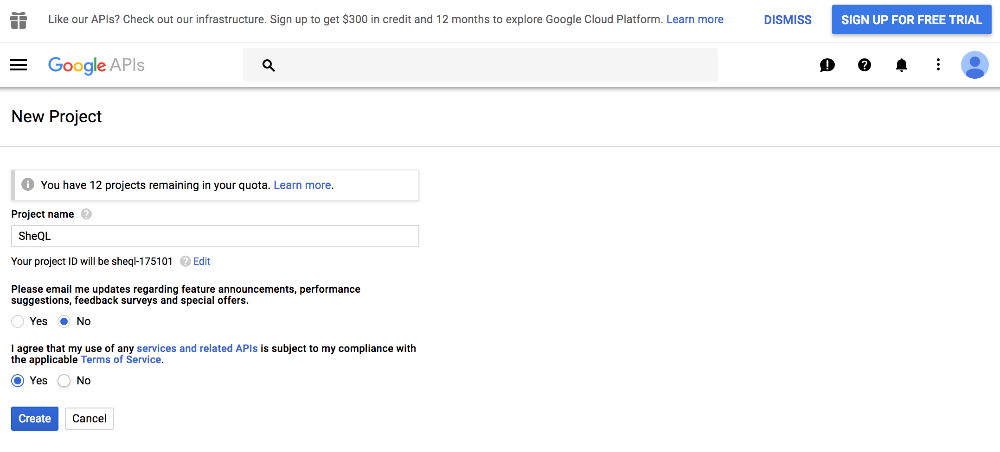
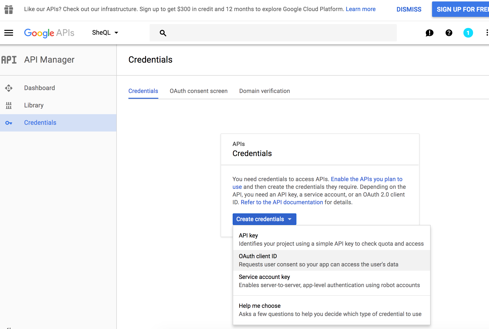
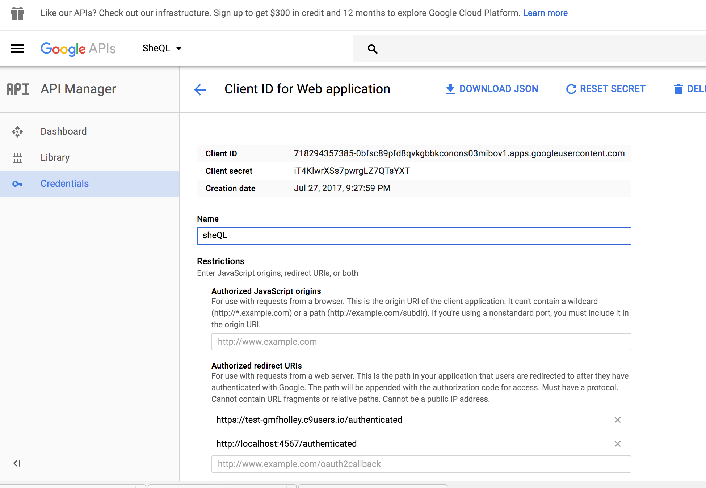
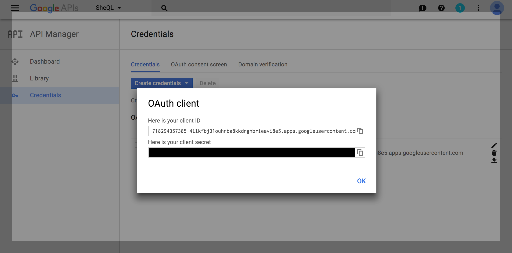
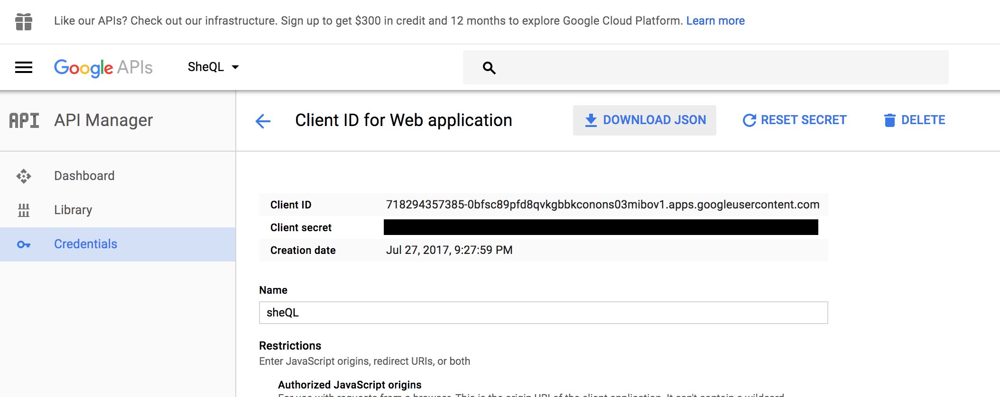
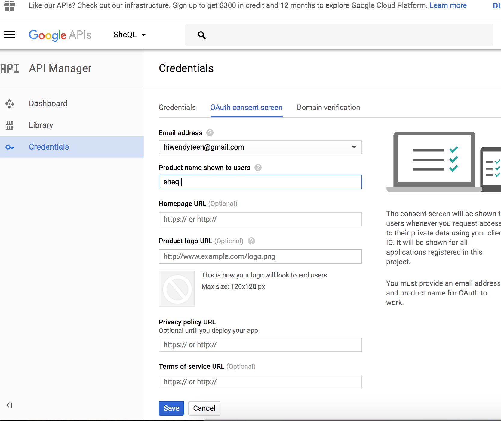
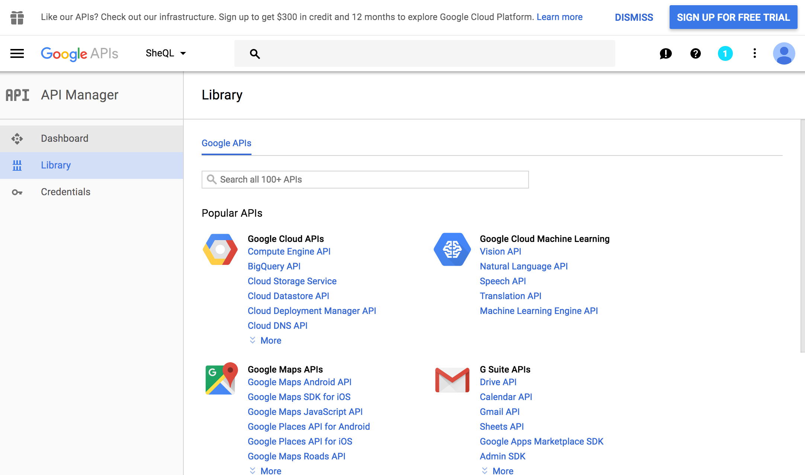
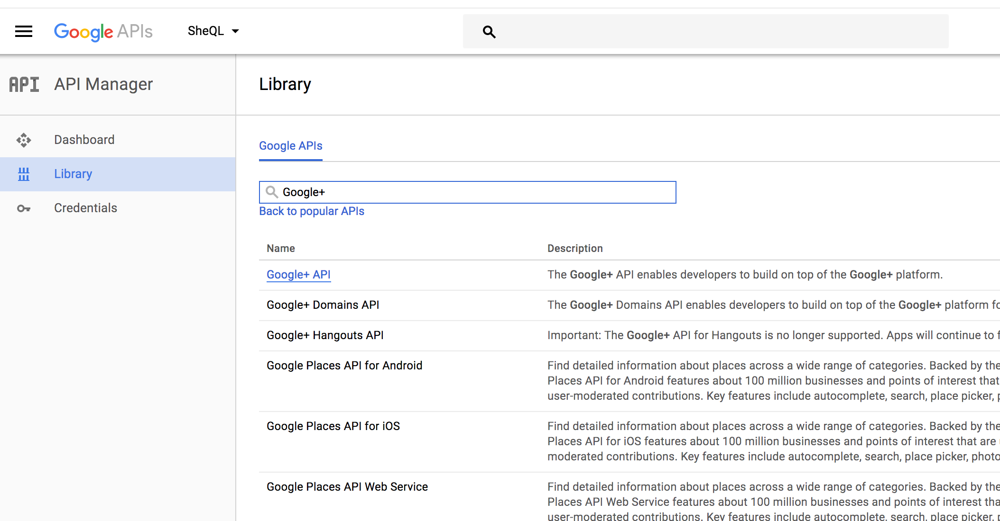
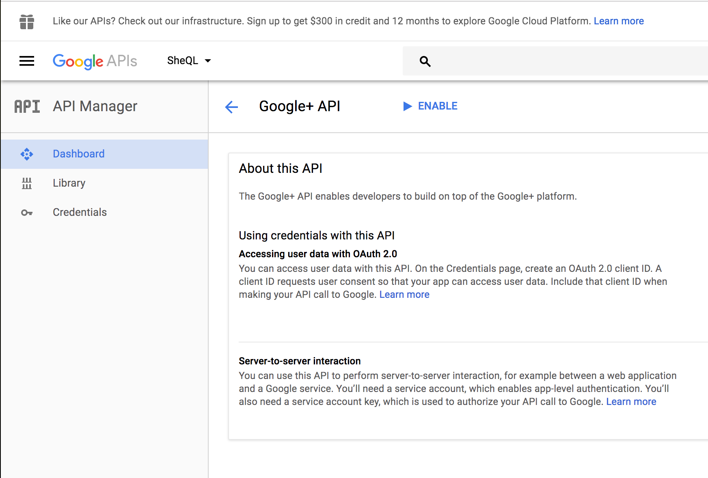

# Google OpenID Authentication
We are using something called the OpenID protocol to authenticate our users - ie, verify who they are.  It allows an external service (Google) to say, "Hey, this person is Janae", and that way our site does not need to handle authentication.  If you did _not_ use Google, your site would have to keep track of passwords, resetting passwords, and encryption.

There are a few steps to the OpenID protocol.

1. We need to register our application with Google, so Google knows who we are and to expect requests from us.  We will receive client secrets file from Google, containing a secret and an ID for our site.
1. When a user tries to log into our site, we need to redirect them to Google.
1. The user logs in on Google.
1. Google redirects the user back to our server, with a one-time code.  Because Google sent the user back, we know `the user is authenticated.`  But we may not know which user.
1. The code we get back is good only once.  We can use it to request a longer-lived access token that is specific to that user.  We need to be careful with access tokens, as anyone who has them can use them.  We also receive a refresh token that we can use to get a new access token when the access token expires.
1. Once we have the access token, we can request any additional information.  We will need to access the user's email (so we know who they are), and we might also want their name or maybe their profile picture.
1. So many trips!  Now that we the information we want, we can store it in a session, which you can think of as temporary storage on the server that is specific to a particular user.  It is not in our ActiveRecord database.  Sinatra generates a random key and sends it back to the user in a cookie.  Every time the user sends a request to your server, the cookie is sent back with the request.  And if the server can match the cookie's key with any saved keys, the server knows which user it is (and that they authenticated already), and the server can access the information we saved into session storage.

## Cloud 9 URL
On Cloud 9, run your sinatra server using `rake serve` and copy the domain of the server as run on Cloud 9.  Keep it handy.  We will need it.

## Register Site with Google
First, log in to your gmail account and then go to the [developer console](https://console.developers.google.com/projectselector/apis/credentials). On the left hand menu, click Credentials and your dashboard should have a button that says Create.  Click that.



Next, Google prompts you to create your project.  Name it something that you will remember.



 Next Google wants to know which APIs you want credentials for.  APIs (Application Programming Interface) are the public methods/functions built into software you can call that will 'do a thing'!  You, the developer of this site, don't have to know how Google does it.  But you and Google both know that if you use their API, Google's software will respond in a particular way.

 We want credentials for `OAuth client ID`, which allows your users to log into your site using Google.




You will be directed to the client id page.  Choose the `Web Application` option.  In the `Authorized Redirect URIs` section, you will want the complete url of where users will be returned after they authenticate. This is the domain you copied from Cloud 9 + the route for where authenticated users should go when they first get logged in.  e.g. Cloud 9 + '/authenticated  = `https://test-gmfholley.c9users.io/authenticated`



Once you set up the client ID, you will get a pop up with your client ID and your client secret.  Do not share your secret with anyone!  Click OK.  



Then click on your credentials again and click on the Download JSON button.  Download that file and save it somewhere.


You will also want to provide some information to the user when you ask them to sign in on Google.  Go to the OAuth consent tab.  If you have a logo, you can supply it.  But for right now, the bare minimum of what you need is a name for your project.  Fill that in and click Save.



Now we will need two other Google APIs enabled in order for this to work: the Google People API and the Google+ API.  On the right-hand nav, switch from 'Credentials' to 'Library'.


Search for 'Google+ API'.  And Click on it.


On the Google+ API page, click on the 'Enable Button'. It should take a moment and update.


Go back to the Library, search for and enable the Google People API.


## Save our client_secrets.json file into our repo

There is a `.gitignore` file inside the root of the repo.  If you open it, you'll notice that it lists a file called `client_secrets.json`.  We want git to ignore that file so it can _never_ become public because it will have our private key in it.  Rename the JSON file you downloaded from Google with _exactly_ the name above.  Then save it in the root of your repo.  (Make sure you are in the right folder - it must be inside the `sheql-start` folder.)


## Turn on Authentication

In your `app.rb` file, we will want to enable authentication.  The `no_authentication?` method is set to true.  Change it to false.

```
# app.rb

...

def no_authentication?
  false
end

```

You should find if you run your server that everything route except the routes listed as `:no_auth_neededs` require authentication now, and the user will be redirected.  If you need to add to the list of unauthenticated routes, you can add it to the array.


```
# app.rb

...

  set :no_auth_neededs, ['/login', '/authenticate', '/authenticated']

```

We also need some code from Google to make our OpenID request, and we should add it to the `configure` block of `app.rb`.

We are using a ruby gem built by Google called google-api-client.  It has some methods that allow us to make the authorization call to Google, fetch the access token, and use the access token to get information.


```
# app.rb

...

configure do

# other stuff is already in here
# do not remove the other code inside config.  Just add the method below to it.
...

  # set up authorization
  unless no_authentication?
    Google::Apis::ClientOptions.default.application_name = 'SheQL'
    Google::Apis::ClientOptions.default.application_version = '1.0.0'

    client_secrets = Google::APIClient::ClientSecrets.load
    authorization = client_secrets.to_authorization
    authorization.scope = 'openid email profile'

    set :authorization, authorization
  end

end

```

It's okay if this code doesn't quite all make sense to you.  But let's understand it in big terms.  The code sets the name and version of our application.  It loads the secrets file.  And it says (in terms of scope), that we want our user's email, profile, and openid (authentication).  Then we are saving it into our settings on the Sinatra server in the line `set :authorization, authorization` line.  With Sinatra's settings, we can save things to settings with that kind of call.


Now we need to set up user_credentials based on the session.  Outside of the `configure do` block, let's define this method.


```
# app.rb

configure do
  ...
  # we have a whole bunch of code here
end

# this is the new code to add
def user_credentials
  # Build a per-request oauth credential based on token stored in session
  # which allows us to use a shared API client.
  @authorization ||= (
    auth = settings.authorization.dup
    auth.redirect_uri = to('/authenticated')
    auth.update_token!(session)
    auth
  )
end

```

The `user_credentials` method duplicates the authorization object we set up in our configure block, for each user.  Now when each user logs on, an object is created that will have enough information to make the call to Google for authentication.


## Create login page

We will use the '/authenticate' route to authenticate users and send them to Google.  And Google will send them back to the '/authenticated' route.

But first, we want a login page that is not authenticated where users can land and can choose whether to log in using Google.  We will probably want a layout file someday, but for now, let's make this work.  Just use a string and embed a link tag that hooks up to the '/authenticate' route.

```
# /routes/authentication.rb

get '/login' do
  # Page where user can log in
  "Hi!  This is my app.  <a href='/authenticate' > Log in Using Google </a>"
end

```

Run your app and confirm that you can click the link over to the '/authenticate' route.


## Direct users to Google's for login
Now let's set up our authentication route.  We are going to redirect our users to Google to sign in.  `redirect` is a Sinatra command.  The rest is part of the `google-api-client` code that will direct to the authorization website.

```
# /routes/authentication.rb

...
get '/authenticate' do
  # Request authorization
  redirect user_credentials.authorization_uri.to_s, 303
end

```

## Google redirects back to us

When we registered our site with Google, we set it up so that the request from Google would come back to the 'authenticated' route.  Let's write that route now.

First we should have a code, and it should be in our Sinatra `params`.  Let's assign it to our user_credentials object.

```
# /routes/authentication.rb

...

get '/authenticated' do
  # Exchange token with Google
  user_credentials.code = params[:code] if params[:code]
end

```

## Use the code to fetch the access token

Now the code is nice, but we really want is access.  Google has built a handy little method to fetch it.

```
...
# /routes/authentication.rb

...

get '/authenticated' do
  # Exchange token with Google
  user_credentials.code = params[:code] if params[:code]

  # get access token
  user_credentials.fetch_access_token!
end
```

In Ruby, when a method has a `!` on it, we know that something unexpected is happening.  In this case, it doesn't just fetch the token, it sets the token to the user_credentials object.  You can see it yourself by calling: `user_credentials.access_token`.

## Use access token to get the information we need.

Let's save the access token now that we have it.  Create a method called `set_user_session` and add the access_token, refresh_token, and other meta information to session.  This method should be outside of all your routes blocks but inside the `authentication.rb` file is fine.

```
...
# /routes/authentication.rb

# Add this method, as we'll use it a lot
def set_user_session
  session[:access_token] = user_credentials.access_token
  session[:refresh_token] = user_credentials.refresh_token
  session[:expires_in] = user_credentials.expires_in
  session[:issued_at] = user_credentials.issued_at
end

```

We have the access token but the access token isn't information.  Let's use the access token to ask Google for what we really want.

There is a single line using Google's gem to go fetch the information.
```
  info_service = Google::Apis::Oauth2V2::Oauth2Service.new
  info = info_service.get_userinfo(options: { authorization: user_credentials.access_token })
```

Let's add that to our method.

```
# /routes/authentication.rb
...

get '/authenticated' do
  # Exchange token with Google
  user_credentials.code = params[:code] if params[:code]

  # get access token
  user_credentials.fetch_access_token!

   # set user tokens into session
  set_user_session

  # use user tokens to request their profile information
  info_service = Google::Apis::Oauth2V2::Oauth2Service.new
  info = info_service.get_userinfo(options: { authorization: user_credentials.access_token })
end
```

## Save the information to session or our database

We want to store the information, at least temporarily.  We can save it to the session.

```
# /routes/authentication.rb

...

get '/authenticated' do
  # Exchange token with Google
  user_credentials.code = params[:code] if params[:code]

  # get access token
  user_credentials.fetch_access_token!

   # set user tokens into session
  set_user_session

  # use user tokens to request their profile information
  info_service = Google::Apis::Oauth2V2::Oauth2Service.new
  info = info_service.get_userinfo(options: { authorization: user_credentials.access_token })

  # save profile information to session
  session[:email] = info.email
  session[:family_name] = info.family_name
  session[:given_name] = info.given_name
  session[:gender] = info.gender
  session[:name] = info.name
  session[:picture] = info.picture
end
```


Or if you have the User model set up, you can save it to the database.

```
# /routes/authentication.rb

...

get '/authenticated' do
  # Exchange token with Google
  user_credentials.code = params[:code] if params[:code]

  # get access token
  user_credentials.fetch_access_token!

   # set user tokens into session
  set_user_session

  # use user tokens to request their profile information
  info_service = Google::Apis::Oauth2V2::Oauth2Service.new
  info = info_service.get_userinfo(options: { authorization: user_credentials.access_token })

  # save profile information to database
  user = User.find_or_initialize_by(email: info.email)
  user.picture = info.picture
  user.name = "#{info.given_name} #{info.family_name}"
  user.save
  session[:current_user_id] = user.id
end
```

## Redirect a logged in user
Finally, we will want to redirect the user somewhere after they are logged in.  The `redirect to('/some-route')` code is how you redirect in Sinatra.


```
# /routes/authentication.rb

...

get '/authenticated' do
  # Exchange token with Google
  user_credentials.code = params[:code] if params[:code]
  user_credentials.fetch_access_token!

  # set user tokens into session
  set_user_session

  # use user tokens to request their profile information
  info_service = Google::Apis::Oauth2V2::Oauth2Service.new
  info = info_service.get_userinfo(options: { authorization: user_credentials.access_token })

  # save profile information to session or database
  ... # whichever code you chose to use

  redirect to('/')
end
```

Now let's confirm that you fetched and saved the information from Google correctly.

If you used session name, try this.

```
#routes.rb


get '/' do
  "Hi, #{session[:name]}.  "
end

```


If you used session user id, try this.

```
#routes.rb


get '/' do
  @user = User.find(session[:current_user_id])
  "Hi, #{@user.name}.  "
end

```

## Add logout

Your users will want to logout.  Since authentication is all stored in the session, all you need to do is destroy the session.

```
# /routes/authentication.rb

...

get '/logout' do
  # Clear the session and redirect to where user can log in
  session.clear
  redirect to('/login')
end

```
